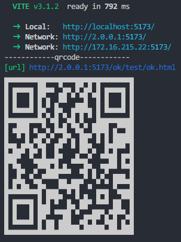

# vite-plugin-qrcode-terminal

> This vite plugin can help you output QR codes on the terminal

## Install

```bash
yarn add vite-plugin-qrcode-terminal -D
# or
npm install vite-plugin-qrcode-terminal -D
```

## Usage

```js
// vite.config.js

import { defineConfig } from 'vite';
import vue from '@vitejs/plugin-vue';
import { vitePluginQrcodeTerminal } from 'vite-plugin-qrcode-terminal';

export default defineConfig({
  plugins: [vue(), vitePluginQrcodeTerminal()],
  server: {
    host: '0.0.0.0',
    open: '/ok/test/ok.html',
  },
});
```

Setup the server, QR codes out in the terminal.



## Interface

```ts
import { Plugin } from 'vite';

interface PluginOption {
  content?: string;
  small?: boolean;
}
declare function vitePluginQrcodeTerminal(params?: PluginOption): Plugin;

export { PluginOption, vitePluginQrcodeTerminal };
```
